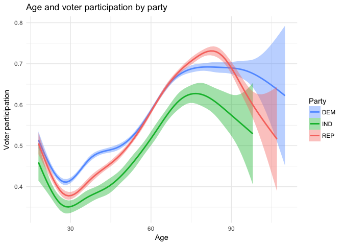

Visualizing Oregon Voter Data
================
Nick Solomon
2/8/2017

``` r
library(tidyverse) # load the package that has many of the functions we need
library(maps)
library(gridExtra)
```

``` r
vote_particip <- read_csv("http://bit.ly/2l1bIxs")
vote_particip$COUNTY <- factor(tolower(vote_particip$COUNTY)) # need this for later
parties = c("DEM", "REP", "IND") # and this too
```

With this first plot, I would like to investigate geographic patterns that arise in registration and participation across political parties. As our data only includes the county of the voter, this is the level of aggregation that I am using. In this plot, I make use of the categorical variables of political party and county, the continuous numeric variable of voter participation, and the discrete numeric variable of number of voters. However, I chose to transform the number of voters into the percent of total voters in the county so as to make equitable comparisons between counties. Therefore, this variable really behaves much more like a continuous quantity for the purposes of plotting.

This graphic more or less necessitates a map, so the county variable is mapped to the position visual cue. Within this framework, the numeric quantities really have no other viable cue except color, so despite its poor interpretability, that visual cue corresponds to percent of registered voters and voter participation. Finally, through the use of faceting, I separated the two numeric variables from each other and broke out the three major political parties recorded.

This graphic could be improved by better labeling of the counties, but I think that would require either making it much bigger, or making it interactive. I also would like to avoid using color, but I am unsure of how to plot the numeric attributes of each county while still maintaining the geographic relations between them.

``` r
# Aggregate to county and party level by averaging p_vote within groups 
vote_particip_mean <- vote_particip %>% 
  group_by(COUNTY, PARTY_CODE) %>% 
  summarise(m = mean(p_vote, na.rm = TRUE))

# Aggregate again but by count this time
vote_particip_count <- vote_particip %>%
  group_by(COUNTY, PARTY_CODE) %>% 
  summarise(n = n()) %>% 
  group_by(COUNTY) %>% 
  mutate(total = sum(n))
```

``` r
# get county polygons and merge with aggregate data
to_map <- map_data("county", "oregon") %>% 
  merge(vote_particip_count, by.x="subregion", by.y="COUNTY") %>% 
  filter(PARTY_CODE %in% parties) # remove minor parties

# A data frame of labels
labels <- to_map %>% 
  group_by(subregion, PARTY_CODE) %>% 
  summarise(long = mean(long), lat = mean(lat)) # put them somewhere near the center

num_voters_plot <- ggplot(to_map, aes(long, lat, group = group, fill = n/total)) +
  geom_polygon() +
  geom_text(aes(x = long, y = lat, label = paste(subregion)), data = labels, size = 3, inherit.aes = FALSE, check_overlap = TRUE, color = "white") +
  coord_map() +
  facet_wrap(~PARTY_CODE) +
  scale_fill_continuous("%", low="#56B1F7", high = "#132B43") + #reverse color scale
  labs(title = "Proportion of county voters registered to major parties") +
  ggforce::theme_no_axes(base.theme = theme_minimal()) +
  theme(panel.background = element_rect(fill = "gray80", linetype = 0 ))

# same game

to_map2 <- map_data("county", "oregon") %>% 
  merge(vote_particip_mean, by.x="subregion", by.y="COUNTY") %>% 
  filter(PARTY_CODE %in% parties)

labels2 <- to_map2 %>% 
  group_by(subregion, PARTY_CODE) %>% 
  summarise(long = mean(long), lat = mean(lat))

p_vote_plot <- ggplot(to_map2, aes(long, lat, group = group, fill = m)) +
  geom_polygon() +
  geom_text(aes(x = long, y = lat, label = paste(subregion)), data = labels2, inherit.aes = FALSE, size = 3, check_overlap = TRUE, color = "white") +
  coord_map() +
  facet_wrap(~PARTY_CODE) +
  scale_fill_continuous("P vote",low="#56B1F7", high = "#132B43") +
  labs(title = "Average county voter participation by party") + 
  ggforce::theme_no_axes(base.theme = theme_minimal()) +
  theme(panel.background = element_rect(fill = "gray80", linetype = 0 ))

# Aaaaand plot
grid.arrange(num_voters_plot, p_vote_plot)
```


By looking at this plot, we can see that there is quite a bit of geographic variance in the prevalence of registered Democrats and Republicans (most likely corresponding to urban and rural areas, respectively), but relatively very little in that of independent voters. We also see that, across parties, there is relatively little variation in voter participation in each county. This suggests that participation rates are more a function of location than of party.

This second graphic attempts to explore the relationship between age and voter participation. Here, I calculated age by subtracting each voter's birth date from today's date. However, this is not the best approach, as it implicitly assumes that a voter's age today influence *all* elections they have voted in. It would be more valid to calculate each voters age at the time of each election, and examine the relationship between those two variables. Additionally, I have removed cases in which either all or none of the possible votes were cast, under the assumption that these represent people who either registered just prior to the most recent election, or just after. These individuals do not have a long enough voting history to be reliable data points. However, this invariably removes some cases that should not have been taken out.

Age and voter participation are both numeric variables mapped to the positions aesthetic using a point geometry. The categorical variable of political party is again shown through small multiples. Each facet also has a smoothed line plotted on it to help discern patterns masked by overplotting.

To improve this graphic, overplotting is the biggest issue that must be addressed. The data collection method creates very dense bands of points along values of fractions with small denominators, (like 1/2, 1/3, or 2/3). I attempted to compensate for this by lowering the opacity of the points, but it is still an issue. Additionally, several issues with the data detracted from the accuracy of this plot. As the voter participation was already collapsed into a single number, I was not able to make more nuanced decisions about which points to remove and was unable to accurately calculate age at each election.

``` r
age <- function(from, to = Sys.Date()){
  # A function to compute ages from stack exchange
  from_lt = as.POSIXlt(from)
  to_lt = as.POSIXlt(to)

  age = to_lt$year - from_lt$year

  ifelse(to_lt$mon < from_lt$mon |
         (to_lt$mon == from_lt$mon & to_lt$mday < from_lt$mday),
         age - 1, age) 
}

# Add in the ages and filter
vote_particip_age <- vote_particip %>% 
  mutate(age = age(BIRTH_DATE)) %>%
  filter(PARTY_CODE %in% parties) %>%
  filter(p_vote != 1 & p_vote != 0)
```

``` r
ggplot(vote_particip_age, aes(age, p_vote)) +
  geom_point(alpha =.1, color = "gray") +
  geom_smooth(fill = "lightskyblue") +
  facet_wrap(~PARTY_CODE) +
  theme_minimal() +
  labs(title = "Age and voter participation by party", x = "Age", y = "Voter participation")
```


This plot's interest lies mostly in the smoothed representation of the data. Across parties, we see an interesting shape where very young voters are more likely to have high participation, but then this quickly falls off. The rate of participation then steadily rises until about seventy, after which it begins to decrease again. This pattern probably results from a narrative that goes something like an eager new voter votes once or twice, but then loses interest. As they age, they become more likely to vote, but once very elderly again become less likely as they lose mobility or experience a decline in health (or die but remain on the rolls, and so in our dataset). Also interesting is the comparison between parties, Democrats are more likely to vote younger and more consistently, seeing a less dramatic dip after age 18. Republicans, on the other hand, show stronger participation in the elderly, with a more pronounced spike just after age seventy. Finally, independents have the lowest participation, starting lower than Republicans and never catching up to the Democrats. To better compare the smoothed trends, here is a plot of of just the three smoothed lines on the same coordinate system.

``` r
ggplot(vote_particip_age, aes(age, p_vote, color = PARTY_CODE)) +
  geom_smooth(aes(fill = PARTY_CODE)) +
  scale_color_discrete(direction = -1, h.start = 90) +
  scale_fill_discrete(direction = -1, h.start = 90) +
  theme_minimal() +
  labs(title = "Age and voter participation by party", x = "Age", y = "Voter participation", color = "Party", fill = "Party")
```


