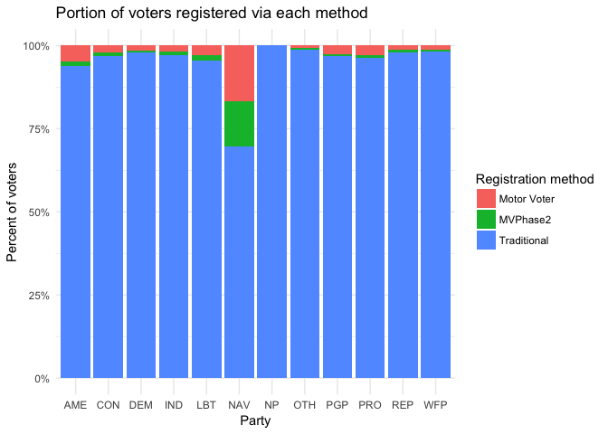
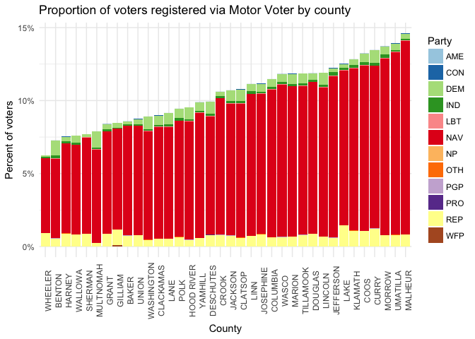
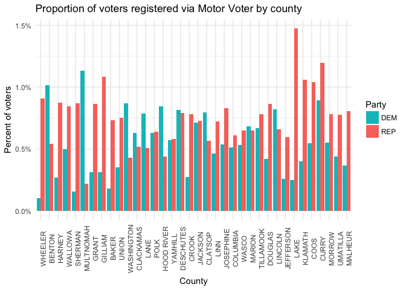
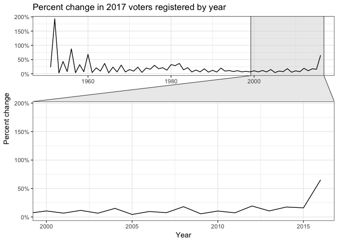
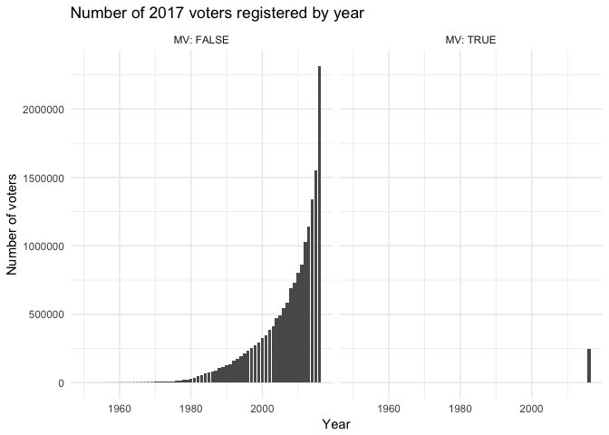

Data Wrangling
================
Nick Solomon
February 13, 2017

``` r
knitr::opts_chunk$set(message = FALSE, warning = FALSE)
```

``` r
library(tidyverse)
library(lubridate)
library(ggforce)
library(scales)
```

``` r
or_regi <- read_csv("http://bit.ly/2kG37yJ")
or_movo <- read_csv("http://bit.ly/2lCadlB")

glimpse(or_regi)
```

    ## Observations: 3,008,433
    ## Variables: 7
    ## $ VOTER_ID      <int> 100743763, 100743762, 100783979, 100505034, 1190...
    ## $ BIRTH_DATE    <chr> "07-15-1966", "02-17-1965", "04-19-1997", "10-04...
    ## $ CONFIDENTIAL  <chr> NA, NA, NA, NA, NA, NA, NA, NA, NA, NA, NA, NA, ...
    ## $ EFF_REGN_DATE <chr> "08-31-2016", "09-20-2016", "12-05-2016", "10-18...
    ## $ STATUS        <chr> "A", "A", "A", "A", "A", "A", "A", "A", "A", "A"...
    ## $ PARTY_CODE    <chr> "NAV", "NAV", "DEM", "IND", "DEM", "REP", "LBT",...
    ## $ COUNTY        <chr> "YAMHILL", "YAMHILL", "YAMHILL", "YAMHILL", "YAM...

``` r
glimpse(or_movo)
```

    ## Observations: 263,727
    ## Variables: 3
    ## $ VOTER_ID    <int> 358947, 427915, 541516, 574177, 660255, 660801, 66...
    ## $ DESCRIPTION <chr> "MVPhase2", "MVPhase2", "MVPhase2", "MVPhase2", "M...
    ## $ COUNTY      <chr> "JACKSON", "BENTON", "LANE", "CLACKAMAS", "UNION",...

Before joining the data, I examined the unique voter IDs to check for uniqueness in both data sets. There are ten duplicates in the registration data. Examining these manually shows that they are all from the same time period and in only a few counties. They probably got entered twice by human error, so I made the decision to remove these rows. As for the motor voter data set, there are 83 duplicated IDs. These probably resulted from registration during the two phases of Oregon Motor Voter. As there are relatively few of these cases and they seem to be out of the ordinary, I removed these rows as well.

I then performed a left join on the two data sets, as I only cared about the voters registered by the Motor Voter program that I had more information about. Therefore, I wanted to keep only the rows from the registration data set that had unique IDs. I expect my joined data set to have 3, 008, 433 − 10 = 3, 008, 423 rows, which it does.

I then proceeded to do some gentle wrangling by replacing `NA`s in the `DESCRIPTION` column with `"Traditional"` and converting character dates to `Date` objects. I then removed confidential and inactive voters and filtered out voters with clearly incorrect birth dates.

``` r
# how many dupes are there?
length(or_regi$VOTER_ID) - length(unique(or_regi$VOTER_ID))
```

    ## [1] 10

``` r
# what are the duplicated rows in or_movo?
dupe_IDs <- or_movo %>% 
  select(VOTER_ID) %>% 
  filter(duplicated(.$VOTER_ID))
dup_records <- or_movo %>% 
  filter(VOTER_ID %in% dupe_IDs$VOTER_ID)

# compare all of them and collect pairs of rows with non-matching county
problem_pairs <- list()
k <- 1
for(i in seq_along(dup_records$VOTER_ID)){
  for(j in seq_along(dup_records$VOTER_ID)){
    if(dup_records[i, "VOTER_ID"] == dup_records[j, "VOTER_ID"]){
      if(any(dup_records[i,-2] != dup_records[j,-2])){
        problem_pairs[[k]] <- c(i, j)
        k <- k+1
      }
    }
  }
}

# there aren't any!
length(problem_pairs)
```

    ## [1] 0

``` r
# filter dupes and join
or_voter <- or_regi %>% 
  distinct(VOTER_ID, .keep_all = TRUE) %>% 
  left_join(
    distinct(or_movo, VOTER_ID, .keep_all = TRUE),
    by = "VOTER_ID", suffix = c("_REGI", "_MOVO"))

# do I have as many rows as I wanted
dim(or_voter)
```

    ## [1] 3008423       9

``` r
or_voter <- or_voter %>%
  mutate(DESCRIPTION = ifelse(is.na(DESCRIPTION), "Traditional", DESCRIPTION)) %>% 
  mutate(BIRTH_DATE = as_date(BIRTH_DATE, format = "%m-%d-%Y")) %>% 
  mutate(EFF_REGN_DATE = as_date(EFF_REGN_DATE, format = "%m-%d-%Y")) %>% 
  filter(is.na(CONFIDENTIAL)) %>% 
  filter(STATUS == "A") %>% 
  filter(BIRTH_DATE > as_date("1902-1-1"))
```

First I wanted to explore the question of whether Motor Voter disproportionately aids one party or another by registering a larger number of voters likely to vote for that party. I measured this by looking at the voter's affiliated party, under the assumption that a voter registered to a party is more likely to vote for that party's candidates. The data set was already in a convenient form to investigate this, so I was able to plot without worry about more wrangling. This question concerns proportions that total up to whole (the total number of voters registered with that party), so I chose to use a stacked bar chart with a bar for each party and the method of registration mapped to the color aesthetic.

``` r
ggplot(or_voter, aes(PARTY_CODE)) + 
  geom_bar(aes(fill = DESCRIPTION), position = "fill") +
  scale_y_continuous(labels = percent) +
  labs(title = "Portion of voters registered via each method", x = "Party", fill = "Registration method", y = "Percent of voters") +
  theme_minimal()
```



We can see that the vast majority of voters in each party registered traditionally. The only party with an unusual number of Motor Voter registrants is the not actually a party at all, but the code for non-affiliated voters. This trend warrants further exploration.

In this next plot, I broke registrations down by county. My first move was to check for any records with counties from each data set that didn't match. Fortunately there were none. Then I created a new logical column that indicated whether the voter was registered by either phase of the Motor Voter program. Next I calculated the proportion of voters registered by Motor Voter in each party within each county. Finally, I computed the total proportion of voters registered by Motor Voter, regardless of party affiliation. I only used this to order the counties nicely in the plot.

``` r
or_voter %>%
  filter(!is.na(COUNTY_MOVO) & !is.na(COUNTY_REGI)) %>%
  filter(COUNTY_REGI != COUNTY_MOVO) %>%
  summarize(n())
```

    ## # A tibble: 1 × 1
    ##   `n()`
    ##   <int>
    ## 1     0

``` r
or_voter_county <- or_voter %>%
  mutate(MV = ifelse(DESCRIPTION == "Traditional", FALSE, TRUE)) %>% 
  group_by(COUNTY_REGI, PARTY_CODE) %>% 
  summarize(N = n(), NUM_MOVO = sum(MV)) %>% 
  group_by(COUNTY_REGI) %>% 
  mutate(TOTAL = sum(N)) %>% 
  mutate(PROP_MOVO = NUM_MOVO/TOTAL) %>% 
  group_by(COUNTY_REGI) %>% 
  mutate(TOTAL_PROP = sum(PROP_MOVO))

ggplot(or_voter_county, aes(reorder(COUNTY_REGI, TOTAL_PROP), PROP_MOVO)) + 
  geom_col(aes(fill = PARTY_CODE)) +
  scale_fill_brewer(palette = "Paired") +
  scale_y_continuous(labels = percent) +
  labs(title = "Proportion of voters registered via Motor Voter by county", 
       x = "County", y = "Percent of voters", fill = "Party") +
    theme_minimal() +
  theme(axis.text.x = element_text(angle = 90))
```



Here we can see that across counties, most Motor Voter registrations are non-affiliated voters. Perhaps this is because the Motor Voter program is primarily registering voters with already low political involvement, so they are not likely to have a preference for any party. The next plot removes these voters (along with all the other minor parties) and allows to examine how Motor Voter effects the two major parties.

``` r
ggplot(filter(or_voter_county, PARTY_CODE %in% c("DEM", "REP")), aes(reorder(COUNTY_REGI, TOTAL_PROP), PROP_MOVO)) +
  geom_col(aes(fill = PARTY_CODE), position = "dodge") +
  scale_y_continuous(labels = percent) +
  scale_fill_discrete(h=c(195, 195+360)) +
  labs(title = "Proportion of voters registered via Motor Voter by county", 
       x = "County", y = "Percent of voters", fill = "Party") +
  theme_minimal() +
  theme(axis.text.x = element_text(angle = 90))
```



We can see that while there is no clear advantage for one party or the other, Republicans might be given a slight edge in registration. This might be due to higher efficacy of the program in areas where Republican support tends to be stronger, like rural counties.

Next, I examined whether or not automatic registration had truly increased the size of the electorate in Oregon. To figure this out, I plotted a time series of the year over year percent change in number of voters registered that are still on the rolls. This number jumps are wildly until about 1990. I suspect that this is because there are much fewer voters still on the rolls from who registered that long ago, so the percent change is very sensitive to small fluctuations. By zooming in on 2000 onward, we can see that things are relatively steady until 2016, when the number jumps up to more than 50%. This does seem to suggest that the Motor Voter program, which implemented automatic registration in 2015, caused the surge in 2016. However, is this jump really attributable to Motor Voter?

``` r
or_voter_year <- or_voter %>%
  mutate(MV = ifelse(DESCRIPTION == "Traditional", FALSE, TRUE)) %>%
  group_by(YEAR = year(EFF_REGN_DATE)) %>% 
  summarise(N=n()) %>% 
  filter(YEAR >= 1950 & YEAR != 2017) %>% 
  mutate(TOTAL = cumsum(N))

or_voter_year <- or_voter_year %>%
  mutate(CHANGE = (TOTAL - lag(TOTAL))/lag(TOTAL))

ggplot(or_voter_year, aes(YEAR, CHANGE)) +
  geom_line() +
  facet_zoom(YEAR >= 2000) +
  scale_y_continuous(labels=percent)+
  labs(title = "Percent change in 2017 voters registered by year", x = "Year", y = "Percent change") +
  theme_bw()
```



To answer this question, I made another plot. This plots the total number of registrants against the year. By comparing the raw, untransformed numbers, we can see that there was a spike in the number of Motor Voter registrants, but that there was also a large spike in the number of traditional registrations. Therefore, it is untrue that this jump was due solely to the Motor Voter program. As usual, it is more complicated than that. The large jump was probably due to a combination of factors, including automatic registration and a particularly contentious presidential election.

``` r
or_voter_year2 <- or_voter %>%
  mutate(MV = ifelse(DESCRIPTION == "Traditional", FALSE, TRUE)) %>%
  group_by(YEAR = year(EFF_REGN_DATE), MV) %>% 
  summarise(N=n()) %>% 
  filter(YEAR >= 1950 & YEAR != 2017) %>% 
  ungroup() %>% 
  group_by(MV) %>% 
  mutate(TOTAL = cumsum(N))

ggplot(or_voter_year2, aes(YEAR, TOTAL)) +
  geom_col() +
  facet_wrap(~MV, labeller = label_both) +
  labs(title = "Number of 2017 voters registered by year", x = "Year", y = "Number of voters") +
  theme_minimal()
```


