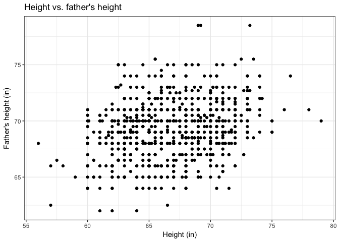
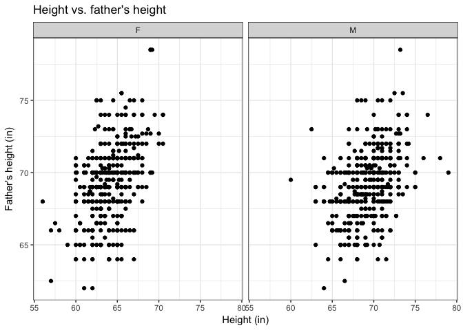
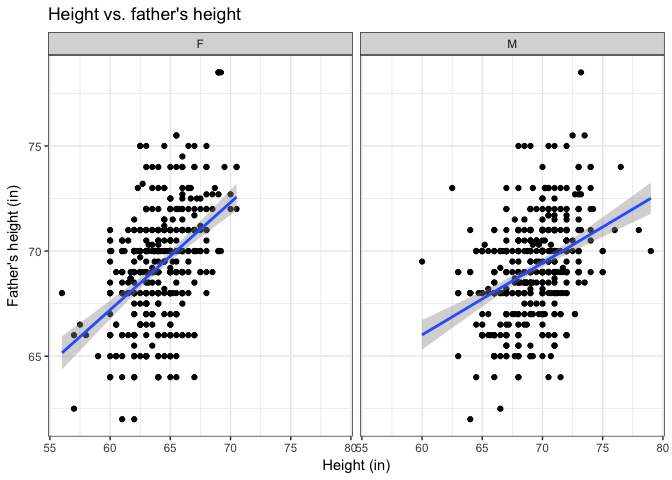
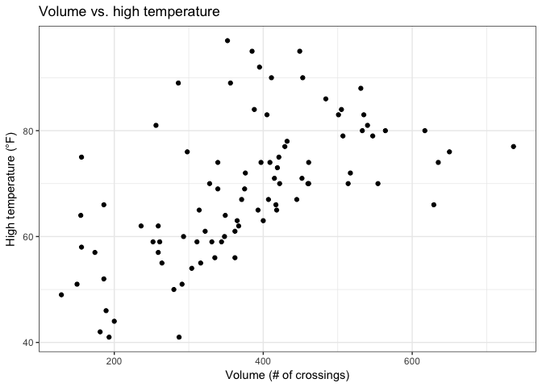
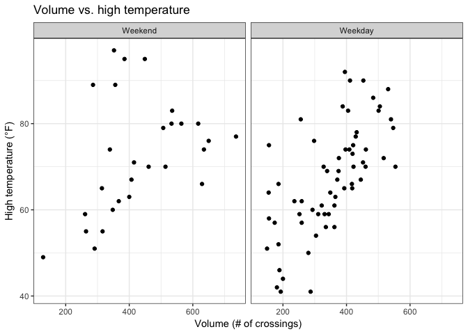
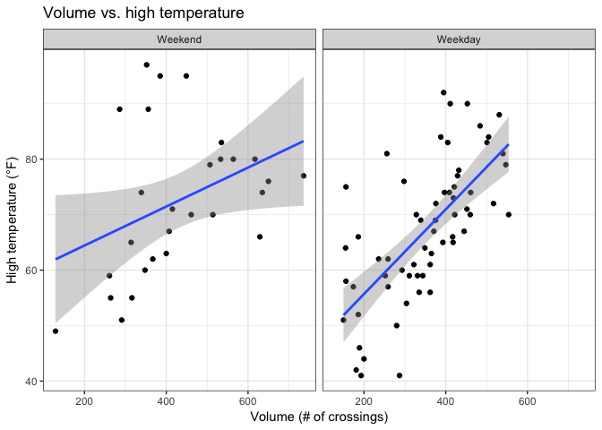
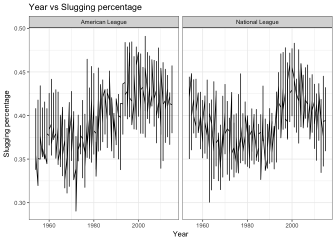

`ggplot2` and `dplyr` review
================
Nick Solomon
February 24, 2017

``` r
knitr::opts_chunk$set(echo = TRUE, warning = FALSE, message = FALSE)
```

``` r
library(tidyverse)
library(mosaic)
library(Lahman)
```

Exercise 3.1
------------

### 1

``` r
height_v_father <- ggplot(Galton, aes(height, father)) +
  geom_point() +
  labs(title = "Height vs. father's height", 
       x = "Height (in)", 
       y = "Father's height (in)") +
  theme_bw()
height_v_father
```



### 2

``` r
height_v_father <- height_v_father + facet_wrap(~sex)
height_v_father
```



### 3

``` r
height_v_father <- height_v_father + geom_smooth(method = "lm")
height_v_father
```



Exercise 3.2
------------

### 1

``` r
vol_vs_htemp <- ggplot(RailTrail, aes(volume, hightemp)) +
  geom_point() +
  labs(title = "Volume vs. high temperature",
       x = "Volume (# of crossings)",
       y = "High temperature (°F)") +
  theme_bw()
vol_vs_htemp
```



### 2

``` r
labels <- c("1" = "Weekday", "0" = "Weekend")
vol_vs_htemp <- vol_vs_htemp + 
  facet_wrap(~weekday, labeller = labeller(weekday = labels))
vol_vs_htemp
```



### 3

``` r
vol_vs_htemp <- vol_vs_htemp + 
  geom_smooth(method = "lm")
vol_vs_htemp
```



Exercise 4.8
------------

``` r
my_teams <- Teams %>% 
  mutate(BA = H/AB,
         SLG = (H + X2B + 2*X3B + 3*HR)/AB)
```

Exercise 4.9
------------

``` r
labels <- c("AL" = "American League",
            "NL" = "National League")
my_teams %>% 
  filter(yearID >= 1954) %>% 
  ggplot(aes(yearID, SLG)) +
    geom_line() +
    facet_wrap(~lgID, labeller = labeller(lgID = labels)) +
    labs(title = "Year vs Slugging percentage",
         x = "Year",
         y = "Slugging percentage")+
    theme_bw()
```



The slugging percentage seems to be higher in the National League. This could be because National League teams tend to play on smaller fields, and so they score more home runs.

Exercise 4.10
-------------

Exercise 4.11
-------------
