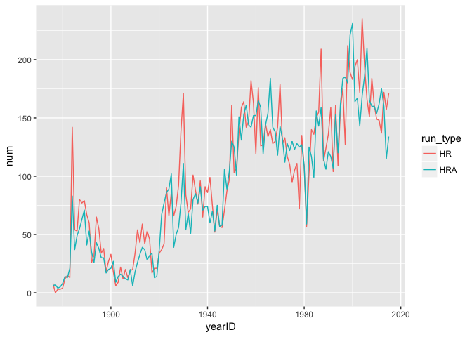

Tidying Oregon Voter Data
================
Nick Solomon
February 27, 2017

``` r
library(tidyverse)
library(Lahman)
```

Part 1
------

### Exercise 5.1

``` r
cubs <- Teams %>% 
  filter(teamID == "CHN") %>% 
  select(yearID, HR, HRA) %>% 
  gather(run_type, num, HR:HRA)

ggplot(cubs, aes(yearID, num, col = run_type)) +
  geom_line()
```



### Exercise 5.6

``` r
ds56 <- tribble(
  ~id, ~group, ~vals,
    1,    "T",    4.0,
    2,    "T",    6.0,
    3,    "T",    8.0,
    1,    "C",    5.0,
    2,    "C",    6.0,
    3,    "C",   10.0
)

Treat <- filter(ds56, group == "T")
Control <- filter(ds56, group == "C")
all <- mutate(Treat, diff = Treat$vals - Control$vals)
all$diff
```

    ## [1] -1  0 -2

Looks good! But if the data is not sorted correctly, then by computing the `diff` column this way, the data would be mismatched and the difference wouldn't be comparing across the same subject. If one of the observations were missing, then `Treat` and `Control` data frames would be differently sized and the `mutate()` call would result in an error.

``` r
ds56_2 <- ds56 %>% 
  spread(group, vals) %>% 
  mutate(diff = T - C)
ds56_2$diff
```

    ## [1] -1  0 -2

### Exercise 5.7

``` r
ds57 <- tribble(
  ~grp, ~sex, ~meanL, ~sdL, ~meanR, ~sdR,
   "A",  "F",    .22,  .11,    .34,  .08,
   "A",  "M",    .47,  .33,    .57,  .33,
   "B",  "F",    .33,  .11,    .40,  .07,
   "B",  "M",    .55,  .31,    .65,  .27
) 

ds57_2 <- ds57 %>%
  gather(key, value, -(grp:sex)) %>% 
  unite(key, sex:key, sep=".") %>% 
  spread(key, value)

knitr::kable(ds57_2, row.names = TRUE)
```

|     | grp |  F.meanL|  F.meanR|  F.sdL|  F.sdR|  M.meanL|  M.meanR|  M.sdL|  M.sdR|
|-----|:----|--------:|--------:|------:|------:|--------:|--------:|------:|------:|
| 1   | A   |     0.22|     0.34|   0.11|   0.08|     0.47|     0.57|   0.33|   0.33|
| 2   | B   |     0.33|     0.40|   0.11|   0.07|     0.55|     0.65|   0.31|   0.27|

Part2
-----

``` r
voter_bits <- list()

for(i in 1:5){
  filename <- paste("or_voter_history/CD", i, "_VoterHistory_Jan2017.txt", sep = "")
  voter_bits[[i]] <- read_tsv(filename)
}

big_voter <- rbind(voter_bits[[1]],
                   voter_bits[[2]],
                   voter_bits[[3]],
                   voter_bits[[4]],
                   voter_bits[[5]])
rm(voter_bits)
```

``` r
set.seed(120932)
voter_sample <- sample_n(big_voter, 100000)
rm(big_voter)
```

``` r
voter_sample <- voter_sample %>% 
  gather(DATE, VOTED, -(VOTER_ID:SPLIT))

voter_sample <- voter_sample %>% 
  mutate(VOTED = ifelse(VOTED == "-", NA, VOTED)) %>% 
  filter(VOTED != "ACP")
```
