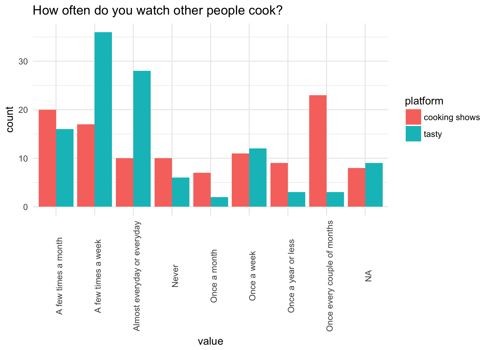
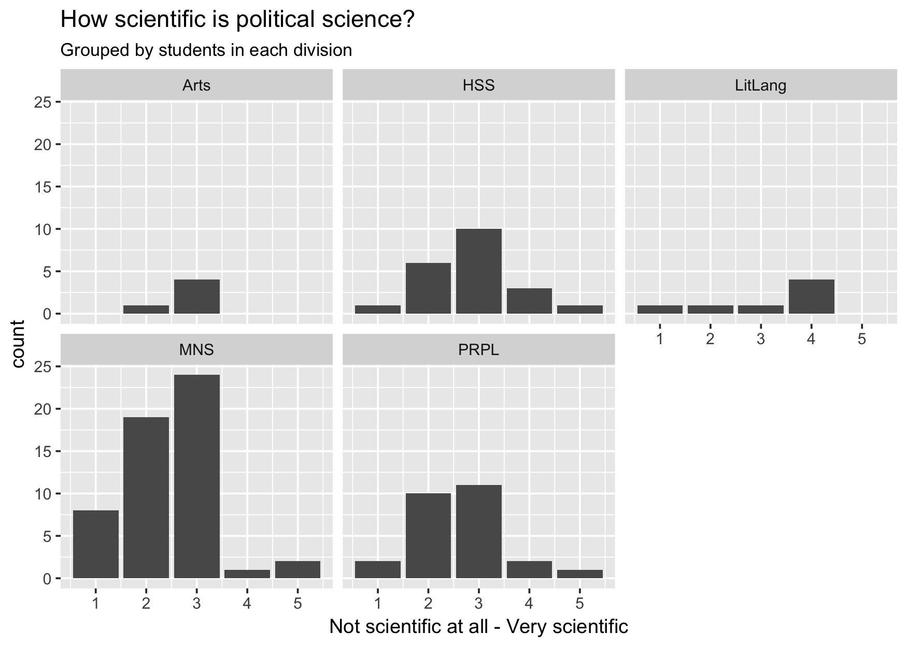
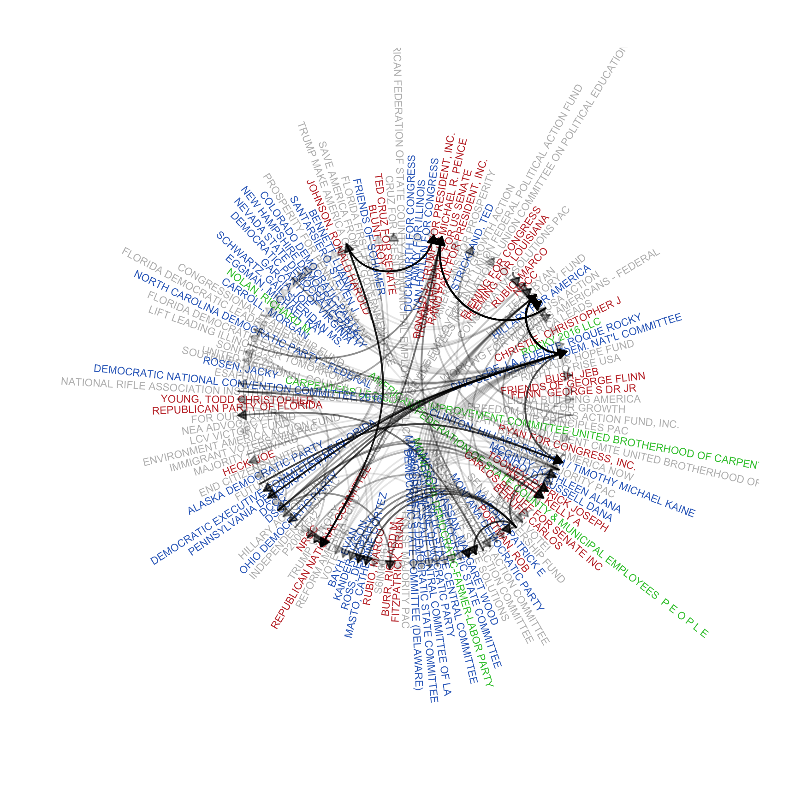

Homework 4: Import
================
Nick Solomon
March 10, 2017

My data
-------

I got these two survey data sets from a friend in the Sociology department. Predictably, they're in the proprietary STATA format. Unfortunately, the `foreign` package can't read data files produced by STATA versions greater than 12, so I used the `readstata13` package to load them.

``` r
food <- read.dta13("data/Food.dta")
science <- read.dta13("data/Science.dta")
```

This data set contains respondents answers to a set of questions about cooking shows and [tasty cooking videos](https://www.youtube.com/channel/UCJFp8uSYCjXOMnkUyb3CQ3Q). It was already in tidy format, so all I had to do was reorder a few of the factors.

``` r
food$cookingamt <- factor(food$cookingamt, levels = levels(food$cookingamt)[c(4, 7,8,5,1, 6,2,3)])
food$tastyamt <- factor(food$tastyamt, levels = levels(food$tastyamt)[c(4, 7,8,5,1, 6,2,3)])
food$tastyshare <- factor(food$tastyshare, levels = levels(food$tastyshare)[c(3, 4, 1, 2)])
food$tastytag <- factor(food$tastytag, levels = levels(food$tastytag)[c(3, 4, 1, 2)])
food$tastyrecipe <- factor(food$tastyrecipe, levels = levels(food$tastyrecipe)[c(2,3,1)])
food$tastyingr <- factor(food$tastyingr, levels = levels(food$tastyingr)[c(2,3,1)])
```

I was curious if Reed students tended to watch Tasty videos or cooking shows more often, so I gathered the data set and made a key column that indicated cooking show or tasty video and another key column that indicated the specific question. I then filtered so that I only had how often respondents watched and made a bar plot, with color mapped to the platform.

``` r
food2 <- food %>%
  gather(key, value) %>% 
  separate(key, c("platform", "variable"), "ooking|asty") %>% 
  mutate(platform = ifelse(platform == "c", "cooking shows", "tasty"))

ggplot(filter(food2, variable == "amt"), aes(value)) +
  geom_bar(aes(fill = platform), position = "dodge") +
  theme_minimal()+
  theme(axis.text.x = element_text(angle = 90)) +
  labs(title = "How often do you watch other people cook?")
```



This next data set contains respondents' ratings of the "scientificness" of different departments at Reed, along with some information about the respondent. There was an extra empty column hanging around, and the factor variables were all numerically coded, so I deleted the empty column and added more informative factor levels. Then I was interested in what each division had to say about political science, so I made a bar chart with a facet for each division in the college.

``` r
science <- science %>% 
  select(-v18)

science$whatareyoumajoringin <- science$whatareyoumajoringin %>% 
  as.factor() %>% 
  fct_recode("Arts" = "1",
             "HSS" = "2",
             "LitLang" = "3",
             "MNS" = "4",
             "PRPL" = "5")

ggplot(science, aes(politicalscience)) +
  geom_bar() +
  facet_wrap(~whatareyoumajoringin) +
  labs(title = "How scientific is political science?",
       subtitle = "Grouped by students in each division",
       x = "Not scientific at all - Very scientific")
```



Campaign Finance
----------------

For the campaign finance section of this problem set, I was interested in the network structure of the transactions between candidates and committees, so I downloaded the 2015-2016 file on transactions from one committee to another from [here](http://www.fec.gov/finance/disclosure/ftpdet.shtml). I also downloaded the candidate and committee master files, so I could link FEC ID's to actual names. Once I had all the data read in, I subsetted it into only new transactions that were greater than $1,000,000. Finally, I made an `igraph` object where each vertex had as an attribute the name and party of the entity and each edge contained the value of the transaction.

``` r
fin_data <- read_delim("data/itoth.txt", "|", col_names = FALSE)
names(fin_data) <- read_csv("data/oth_header_file.csv", col_names = TRUE) %>% 
  names()

fin_data2 <- fin_data %>%
  filter(AMNDT_IND == "N", !is.na(OTHER_ID), TRANSACTION_AMT > 1000000) %>%
  select(CMTE_ID, ENTITY_TP, NAME:OCCUPATION, TRANSACTION_DT:OTHER_ID)

com_names <- read_delim("data/cm.txt", "|", col_names = FALSE)
names(com_names) <- names(read_csv("data/cm_header_file.csv"))
com_names <- com_names %>% select(CMTE_ID, CMTE_NM, CMTE_PTY_AFFILIATION) %>% 
  rename(FEC_ID = CMTE_ID, name = CMTE_NM, party = CMTE_PTY_AFFILIATION)

cand_names <- read_delim("data/cn.txt", delim = "|", col_names = FALSE)
names(cand_names) <- names(read_csv("data/cn_header_file.csv"))

cand_names <- cand_names %>% select(CAND_ID:CAND_PTY_AFFILIATION) %>%
  rename(FEC_ID = CAND_ID, name = CAND_NAME, party = CAND_PTY_AFFILIATION)

all_names <- bind_rows(com_names, cand_names)

fin_net <- graph_from_edgelist(as.matrix(fin_data2[,c("CMTE_ID", "OTHER_ID")]))


node_attrs <- tibble(FEC_ID = vertex_attr(fin_net)$name) %>% 
  left_join(all_names, by = c("FEC_ID" = "FEC_ID"))

node_attrs[which(is.na(node_attrs$name)), "name"] <- c("AMERICANS FOR PROSPERITY",
                                                "CLUB FOR GROWTH",
                                                NA,
                                                NA,
                                                "MAJORITY FORWARD",
                                                "NATIONAL RIFLE ASSOCIATION INSTITUTE FOR LEGISLATIVE ACTION",
                                                NA,
                                                "LIFT LEADING ILLINOIS FOR TOMORROW",
                                                "FLORIDA DEMOCRATIC EXECUTIVE BOARD",
                                                "FLORIDA DEMOCRATIC LEADERSHIP FEDERAL COMMITTEE",
                                                "SAVE AMERICA FROM ITS GOVERNMENT",
                                                "AMERICAN FEDERATION OF STATE COUNTY AND MUNICIPAL EMPLOYEES AFL-CIO")

node_attrs <- node_attrs %>% 
  mutate(name = ifelse(is.na(name), FEC_ID, name))

edge_attr(fin_net, "TRANSACTION_AMT") <- fin_data2$TRANSACTION_AMT
vertex_attr(fin_net, "name") <- node_attrs$name
vertex_attr(fin_net, "party") <- node_attrs$party %>% 
  as.factor() %>%
  fct_recode("Democrat" = "DEM",
             "Republican" = "REP",
             "Other" = "DFL",
             "Other" = "IND",
             "Other" = "NNE",
             "Other" = "UNK") %>% 
  as.character()
```

This plot shows the network of transactions with edge opacity mapped to the value and node color mapped to the political party affiliation.

``` r
my_arrow <- arrow(length = unit(2, "mm"), type = "closed")

fin_net_plot <- ggraph(fin_net, layout = "linear", circular = TRUE) + 
  geom_node_text(aes(label = name, 
                     color= party, 
                     angle = atan(y/x)*180/pi),
                 show.legend = FALSE,
                 size = 2.3) +
  geom_edge_arc(aes(alpha = TRANSACTION_AMT),
                arrow = my_arrow,
                show.legend = FALSE) +
  scale_color_manual(values = c(Democrat = "#3b71c6",
                                Republican = "#c63b3b",
                                Other = "#3bc63d"),
                     na.value = "gray") +
  scale_x_continuous(expand = c(.5,.1)) +
  scale_y_continuous(expand = c(.5,.1)) +
  theme_graph()
fin_net_plot
```



This plot has some obvious issues. For one, these names are very long. Some shortening by a person more knowledgeable about the landscape of campaign finance could probably be done. For another, the political part of many of the nodes was not registered with the FEC, so they are marked as unaffiliated. This is obviously untrue in many cases; I doubt the Hillary Action Fund is really not affiliated with the Democratic party.
